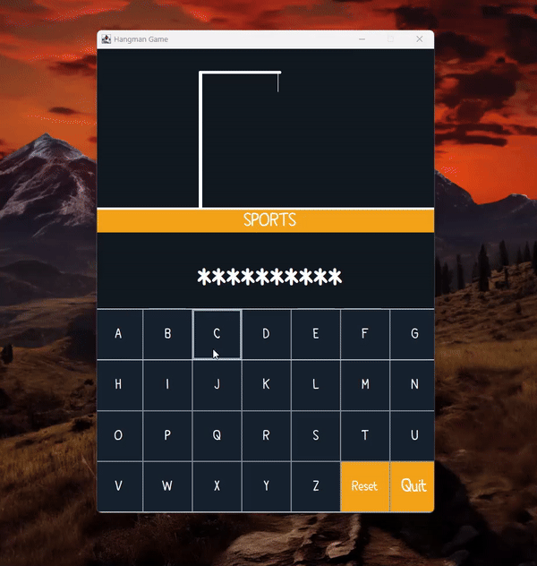

<!--Project Name-->
<h1>Hangman Game (JAVA Swing)</h1>

<!--Introduction-->
<h2>Introduction</h2>

Hangman is a classic word-guessing game that has been popular for generations. The game is typically played between two players or a player and a computer. One player thinks of a word, and the other player tries to guess it by suggesting letters within a certain number of attempts.

<!--Technologies/Frameworks-->
<h2>Technologies Frameworks</h2>
<ul>
  <li><b>JDK 18+</b> - Java Version</li>
  <li><b>JTatoo</b> - Look and Feel Theme</li>
</ul>

<!--Screenshots (GIFs/PNGs)-->
<h2>Quick Demo</h2>

  

